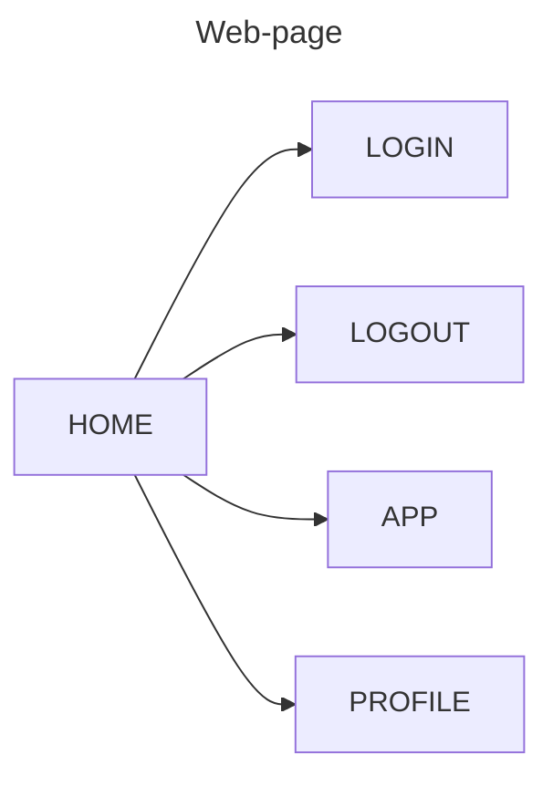
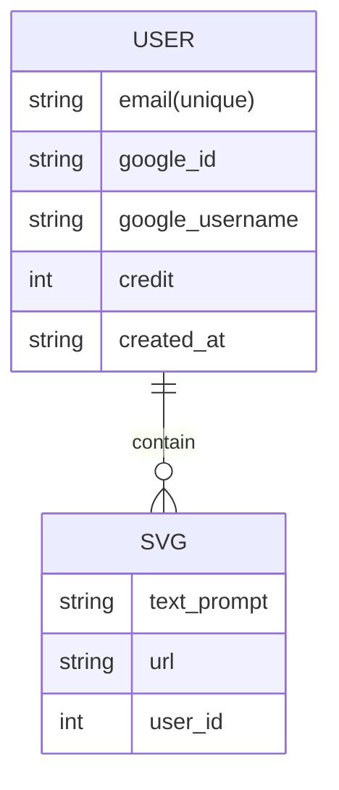

# WF Tech


## Web Pages



## Data Model




## ROUTES For Web App.

```txt
FE
/ -> Home Page
/#/login -> Login Page
/#/app -> SVG Gen App
/#/profile -> Profile Page With Credits


BE
/api/svg -> post -> create a new svg
/api/svg -> get -> return all the svg
/api/svg/{id} -> get -> result for particular svg

/api/auth/google/login -> login
/api/auth/google/callback -> callback
/api/auth/google/logout -> logout
```


## TASK

- [ ] add credits to the users
- [ ] add svg to backend instead of todo.
- [ ] design the pages FE.
- [ ] login & logout flows.
- [ ] Flow for Credits exhausting.
- [ ] Thinks about the business related steps to launch the product.